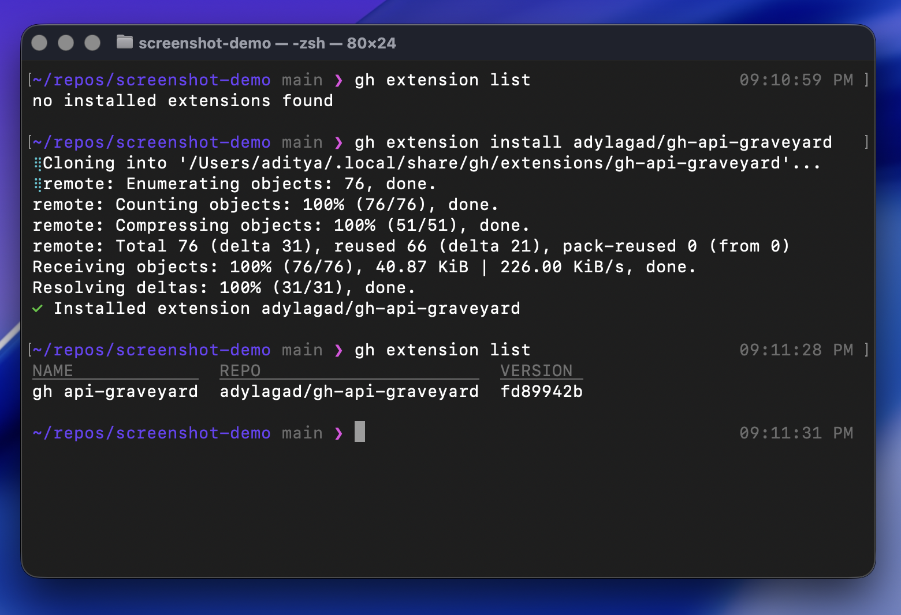
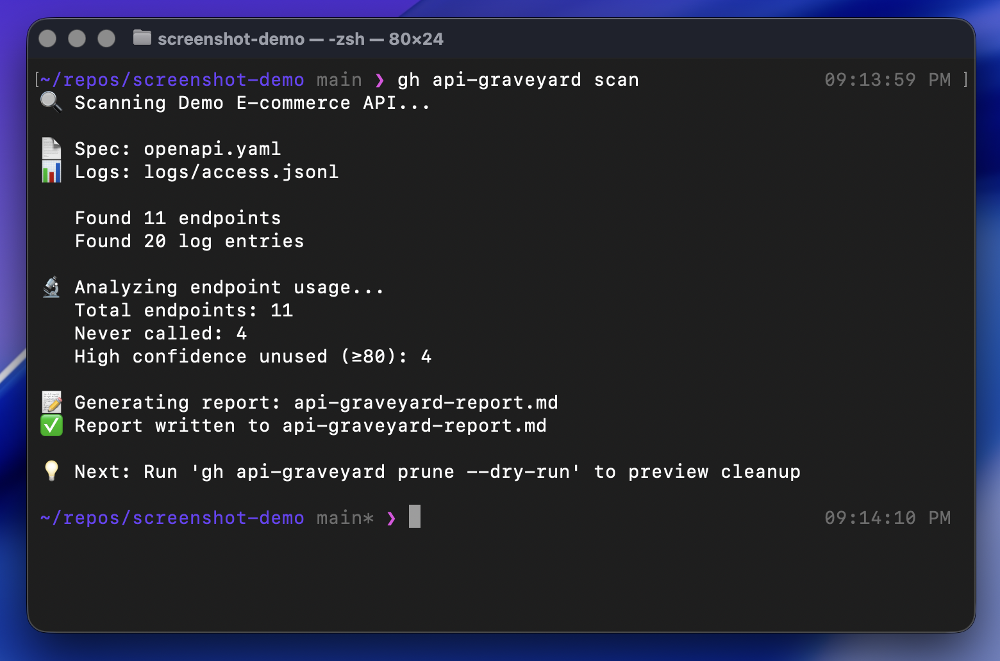
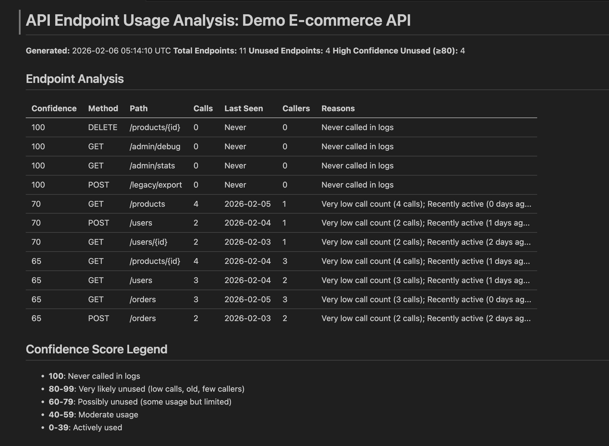
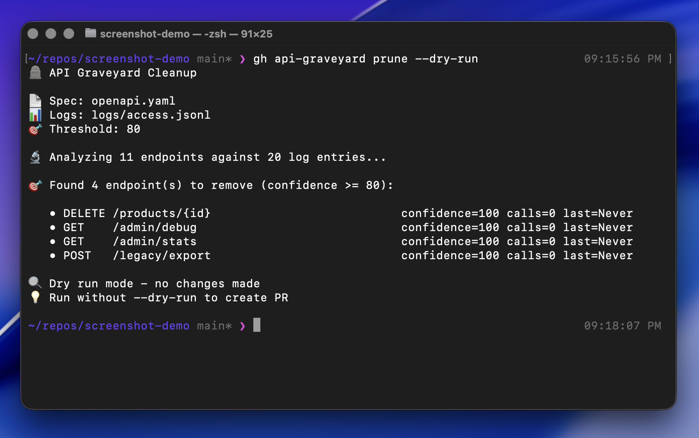
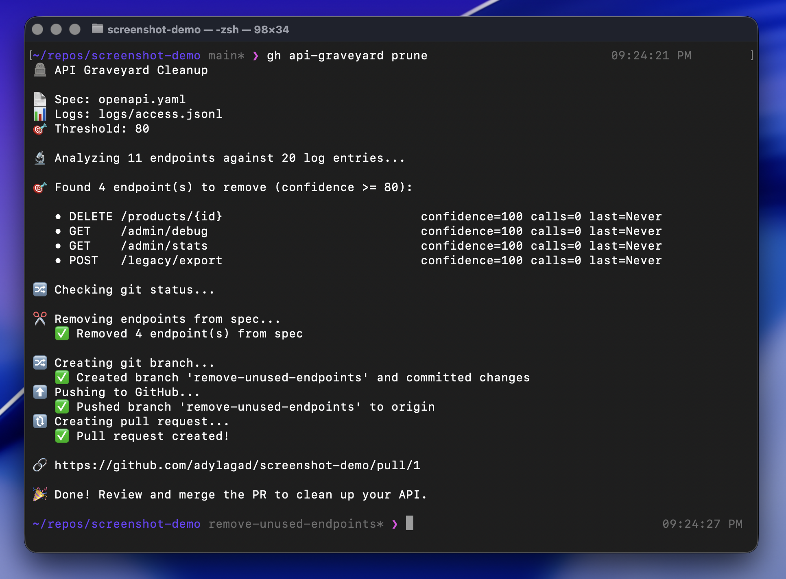
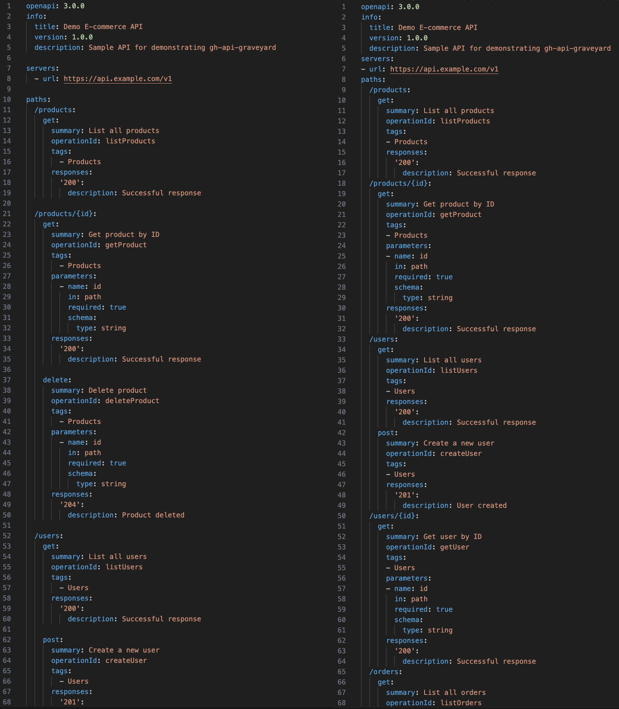
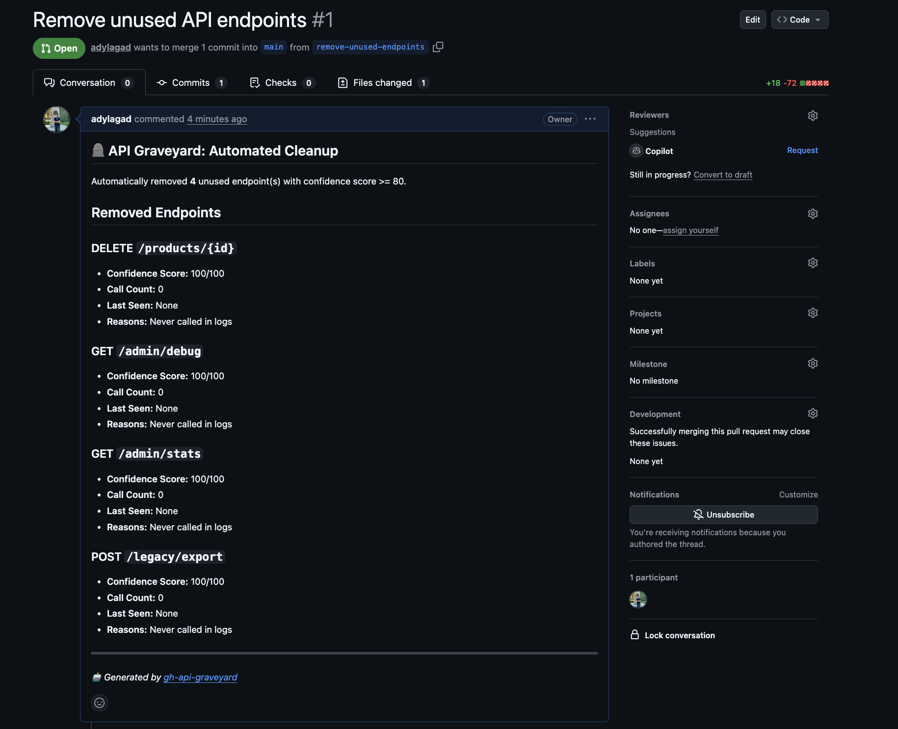

*This is a submission for the [GitHub Copilot CLI Challenge](https://dev.to/challenges/github-2026-01-21)*

## What I Built 🚀

**gh-api-graveyard** - A GitHub CLI extension that automatically finds and removes unused API endpoints from your OpenAPI specifications.

🪦 The tool that cleans up dead endpoints so you don't have to.

### The Problem 🤔

Over time, APIs accumulate "dead" endpoints - routes that were created but never used, deprecated features nobody calls anymore, or experimental endpoints that didn't pan out. These clutter your codebase, create maintenance burden, and confuse developers about what's actually in use.

### The Solution 💡

**gh-api-graveyard** automates the entire cleanup process:

1. **Auto-discovers** your OpenAPI spec and access logs (no configuration needed!)
2. **Analyzes** usage patterns with intelligent confidence scoring (0-100)
3. **Generates** detailed markdown reports with actionable insights
4. **Creates** pull requests to remove high-confidence unused endpoints
5. **Handles failures** gracefully with automatic rollback

### Key Features ⚡

✨ **Intelligent Auto-Discovery**
- Searches common locations for OpenAPI specs
- Finds log files automatically (JSONL format)
- Reads optional `.graveyard.yml` config file

🧠 **Smart Analysis**
- Path template matching (handles `/users/{id}` patterns)
- Multi-factor confidence scoring (frequency, recency, caller diversity)
- Generates professional markdown reports

🤖 **Automated PR Creation**
- Creates git branches with unique timestamps
- Commits spec changes
- Pushes to GitHub
- Creates detailed pull requests
- Automatic rollback on failure

### Simple Commands 💻

```bash
# Install
gh extension install adylagad/gh-api-graveyard

# Scan for unused endpoints
gh api-graveyard scan

# Preview what would be removed
gh api-graveyard prune --dry-run

# Create PR to remove unused endpoints
gh api-graveyard prune
```

**Repository:** https://github.com/adylagad/gh-api-graveyard

---

## Demo 🎬

### Installation & Setup 📦

*Installing the extension is as simple as one command*

### Scanning for Unused Endpoints 🔍

*The scan command auto-discovers your files and analyzes usage*

### Generated Report 📊

*Professional markdown reports with confidence scores and insights*

### Dry Run Preview 👀

*Preview exactly what will be removed before making changes*

### Creating the PR 🔀

*Automated branch creation, commits, and PR generation*

### Before & After ✨

*Clean OpenAPI specs with unused endpoints removed*

### Pull Request 🎯

*Detailed PRs with all the context your team needs*

**Live Project:** https://github.com/adylagad/gh-api-graveyard

---

## My Experience with GitHub Copilot CLI ✨

Building **gh-api-graveyard** was my first experience working entirely with GitHub Copilot CLI, and it completely changed how I think about development. Every single aspect of this project - from initial planning to final refactoring - was built through conversation with Copilot CLI.

### How I Used Copilot CLI 🛠️

**Phase 1: Planning with `[[PLAN]]` Mode** 📋

I started by using plan mode to break down the project:
```
[[PLAN]] Build a GitHub CLI extension that finds unused API endpoints
```

Copilot CLI helped me:
- Design the module structure
- Identify required libraries (Click, PyYAML, GitPython)
- Plan the confidence scoring algorithm
- Create a step-by-step implementation roadmap

**Phase 2: Core Development** 💻

For each feature, I described what I needed and Copilot CLI wrote the code:

- "Parse OpenAPI YAML files and extract all endpoints"
- "Load JSONL log files and handle malformed entries gracefully"
- "Match concrete paths like /users/123 to templates like /users/{id}"
- "Calculate confidence scores based on frequency, recency, and caller diversity"

The best part? When I asked for something, Copilot CLI didn't just write the function - it added proper error handling, type hints, and docstrings automatically.

**Phase 3: Git Integration** 🔄

Building the automated PR creation was complex, but Copilot CLI guided me through:
- Branch creation with unique timestamps
- GitPython operations
- PyGithub API integration
- Error recovery and rollback strategies

**Phase 4: Bug Fixing & Refinement** 🐛

This is where Copilot CLI really shined. I'd describe issues like:
- "When branch creation fails, the openapi file is already modified"
- "The command shows 'gh graveyard' but should be 'gh api-graveyard'"
- "If the branch already exists, it should create a unique name"

Each time, Copilot CLI not only fixed the bug but suggested improvements I hadn't considered.

**Phase 5: Refactoring** 🔨

When I requested "Please refactor the project and organize functions into logical modules," Copilot CLI:
- Analyzed the entire codebase
- Split the monolithic `utils.py` (455 lines) into focused modules
- Removed unused code (`analyzer.py`)
- Fixed all command references in README
- Updated imports across all files
- Tested everything still worked

### What Impressed Me Most 🌟

**1. Context Awareness** 🧠

Copilot CLI maintained context across multiple sessions. It remembered architectural decisions from days ago and applied them consistently.

**2. Proactive Problem Solving** 🎯

It didn't just do what I asked - it anticipated issues:
- "We should check git status BEFORE modifying files, not after"
- "The function should return the actual branch name for proper cleanup"
- "Add generated reports to .gitignore"

**3. End-to-End Capability** 🚀

From planning to documentation (yes, even this submission!), Copilot CLI handled everything. I never had to switch contexts or manually write boilerplate.

**4. Learning & Improving** 📈

When testing revealed issues, I'd paste the error and Copilot CLI would:
- Explain what went wrong
- Fix the issue
- Add safeguards to prevent similar problems
- Suggest related improvements

### Impact on My Development Experience 💫

**Speed:** What would normally take days took hours. The planning phase alone saved me significant time. ⚡

**Quality:** The code is cleaner than I would have written manually. Copilot CLI consistently added proper error handling, type hints, and documentation. ✨

**Confidence:** Having an AI pair programmer that catches mistakes and suggests improvements made me more confident in trying ambitious features. 💪

**Learning:** I learned best practices for CLI tools, Git automation, and Python project structure through Copilot CLI's suggestions. 📚

### Specific Examples 🔍

**Before Copilot CLI (hypothetical manual approach):**
```python
def remove_endpoints(spec_path, endpoints):
    # Load file
    # Parse YAML
    # Remove endpoints
    # Save file
    # Hope nothing breaks
```

**With Copilot CLI:**
```python
def remove_endpoints_from_spec(
    spec_path: Path,
    endpoints_to_remove: List[Dict[str, str]]
) -> tuple[bool, str, int]:
    """
    Remove endpoints from OpenAPI spec file.
    Returns: (success, message, count_removed)
    """
    # Proper error handling
    # Atomic file operations
    # Clear return values
    # Comprehensive docstring
```

### The "Aha!" Moment 💡

The biggest revelation came when debugging the git status issue. I described the problem: "The extension fails to create a branch, but I remain on main. When I run prune again, it reports the endpoints have already been removed."

Copilot CLI immediately understood the race condition, suggested checking git status BEFORE modifying files, added rollback logic, and even updated the function signature to return the actual branch name for proper cleanup. That level of understanding was mind-blowing.

### Challenges Overcome 🏆

- **Repository naming:** GitHub CLI extensions must start with `gh-`. Copilot CLI helped rename the repo and update all references.
- **Path matching:** Needed to match `/users/123` to `/users/{id}`. Copilot CLI implemented a segment-based algorithm.
- **Confidence scoring:** Balancing multiple factors (frequency, recency, callers). Copilot CLI suggested a weighted approach.
- **Rollback logic:** Complex error recovery. Copilot CLI implemented proper git rollback with branch cleanup.

### Would I Use It Again? 🤔

Absolutely. GitHub Copilot CLI isn't just a code generator - it's a knowledgeable pair programmer that understands context, anticipates problems, and suggests improvements. It made building a production-ready CLI extension feel like a conversation rather than a coding marathon.

**Even this submission document was written using GitHub Copilot CLI.** 🤖

I asked: "I need to write a submission document. Can you help me with this?" and it created a comprehensive document. When I said "I've added the required template to template.txt file. Please reformat the submission according to that template," it reformatted everything to match perfectly.

That's the magic of Copilot CLI - it adapts to your needs, learns your style, and delivers exactly what you ask for.

---

## Technical Details 🔧

**Built with:** 🛠️
- Python 3.x 🐍
- Click (CLI framework) 💻
- PyYAML (OpenAPI parsing) 📄
- GitPython (Git automation) 🔄
- PyGithub (PR creation) 🔀

**Project Structure:** 📁
```
gh-api-graveyard/
├── detector/
│   ├── cli.py           # CLI commands
│   ├── parsers.py       # OpenAPI & log parsing
│   ├── analysis.py      # Usage analysis
│   ├── reports.py       # Report generation
│   ├── spec_modifier.py # Spec modification
│   ├── git_ops.py       # Git operations
│   └── discovery.py     # Auto-discovery
└── samples/             # Example files
```

**Installation:** 📦
```bash
gh extension install adylagad/gh-api-graveyard
```

---

*Every line of code, every design decision, and this entire submission was created with GitHub Copilot CLI* ✨
